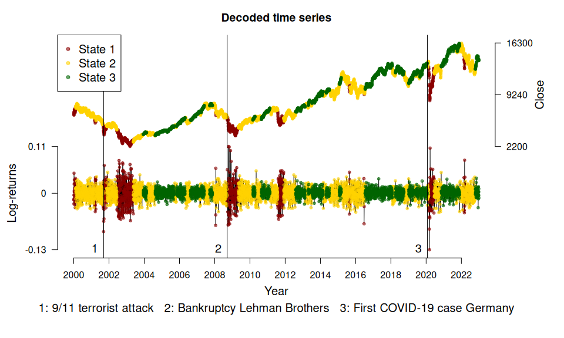

<!-- README.md is generated from README.Rmd. Please edit that file -->

# HMMs for Finance <a href="https://loelschlaeger.de/fHMM/"></a>

<!-- badges: start -->

[](https://CRAN.R-project.org/package=fHMM)
[](https://cran.r-project.org/package=fHMM)
[](https://github.com/loelschlaeger/fHMM/actions/workflows/R-CMD-check.yaml)
[](https://app.codecov.io/gh/loelschlaeger/fHMM)
[](https://lifecycle.r-lib.org/articles/stages.html#stable)
<!-- badges: end -->

The `{fHMM}` R package allows for the detection and characterization of
financial market regimes in time series data by applying hidden Markov
Models (HMMs). The [vignettes](https://loelschlaeger.de/fHMM/articles/)
outline the package functionality and the model formulation.

For a reference on the method, see:

> Oelschläger, L., and Adam, T. 2021. “Detecting Bearish and Bullish
> Markets in Financial Time Series Using Hierarchical Hidden Markov
> Models.” Statistical Modelling.
> <https://doi.org/10.1177/1471082X211034048>

A user guide is provided by the accompanying software paper:

> Oelschläger, L., Adam, T., and Michels, R. 2024. “fHMM: Hidden Markov
> Models for Financial Time Series in R”. Journal of Statistical
> Software. <https://doi.org/10.18637/jss.v109.i09>

Below, we illustrate an application to the German stock index
[DAX](https://en.wikipedia.org/wiki/DAX). We also show how to use the
package to simulate HMM data, compute the model likelihood, and decode
the hidden states using the Viterbi algorithm.

## Installation

You can install the released package version from
[CRAN](https://CRAN.R-project.org) with:

``` r
install.packages("fHMM")
```

## Contributing

We are open to contributions and would appreciate your input:

- If you encounter any issues, please [submit bug reports as
  issues](https://github.com/loelschlaeger/fHMM/issues/new?assignees=&labels=bug&template=bug.md).

- If you have any ideas for new features, please submit them as [feature
  requests](https://github.com/loelschlaeger/fHMM/issues/new?assignees=&labels=future&template=suggestion.md).

- If you would like to add extensions to the package, please fork the
  `master` branch and submit a merge request.

## Example: Fitting an HMM to the DAX

We fit a 3-state HMM with state-dependent t-distributions to the DAX
log-returns from 2000 to 2022. The states can be interpreted as proxies
for bearish (green below) and bullish markets (red) and an “in-between”
market state (yellow).

``` r
library("fHMM")
```

The package has a build-in function to download financial data from
[Yahoo Finance](https://finance.yahoo.com/):

``` r
dax <- download_data(symbol = "^GDAXI")
```

We first need to define the model:

``` r
controls <- set_controls(
  states      = 3,
  sdds        = "t",
  file        = dax,
  date_column = "Date",
  data_column = "Close",
  logreturns  = TRUE,
  from        = "2000-01-01",
  to          = "2022-12-31"
)
```

The function `prepare_data()` then prepares the data for estimation:

``` r
data <- prepare_data(controls)
```

The `summary()` method gives an overview:

``` r
summary(data)
#> Summary of fHMM empirical data
#> * number of observations: 5882 
#> * data source: data.frame 
#> * date column: Date 
#> * log returns: TRUE
```

We fit the model and subsequently decode the hidden states and compute
(pseudo-) residuals:

``` r
model <- fit_model(data)
model <- decode_states(model)
model <- compute_residuals(model)
```

The `summary()` method gives an overview of the model fit:

``` r
summary(model)
#> Summary of fHMM model
#> 
#>   simulated hierarchy       LL       AIC       BIC
#> 1     FALSE     FALSE 17650.02 -35270.05 -35169.85
#> 
#> State-dependent distributions:
#> t() 
#> 
#> Estimates:
#>                   lb   estimate        ub
#> Gamma_2.1  2.754e-03  5.024e-03 9.110e-03
#> Gamma_3.1  2.808e-16  2.781e-16 2.739e-16
#> Gamma_1.2  1.006e-02  1.839e-02 3.338e-02
#> Gamma_3.2  1.514e-02  2.446e-02 3.927e-02
#> Gamma_1.3  5.596e-17  5.549e-17 5.464e-17
#> Gamma_2.3  1.196e-02  1.898e-02 2.993e-02
#> mu_1      -3.862e-03 -1.793e-03 2.754e-04
#> mu_2      -7.994e-04 -2.649e-04 2.696e-04
#> mu_3       9.642e-04  1.272e-03 1.579e-03
#> sigma_1    2.354e-02  2.586e-02 2.840e-02
#> sigma_2    1.225e-02  1.300e-02 1.380e-02
#> sigma_3    5.390e-03  5.833e-03 6.312e-03
#> df_1       5.550e+00  1.084e+01 2.116e+01
#> df_2       6.785e+00  4.866e+01 3.489e+02
#> df_3       3.973e+00  5.248e+00 6.934e+00
#> 
#> States:
#> decoded
#>    1    2    3 
#>  704 2926 2252 
#> 
#> Residuals:
#>      Min.   1st Qu.    Median      Mean   3rd Qu.      Max. 
#> -3.517900 -0.664018  0.012170 -0.003262  0.673180  3.693568
```

Having estimated the model, we can visualize the state-dependent
distributions and the decoded time series:

``` r
events <- fHMM_events(
  list(dates = c("2001-09-11", "2008-09-15", "2020-01-27"),
       labels = c("9/11 terrorist attack", "Bankruptcy Lehman Brothers", "First COVID-19 case Germany"))
)
plot(model, plot_type = c("sdds","ts"), events = events)
```

<!-- --><!-- -->

The (pseudo-) residuals help to evaluate the model fit:

``` r
plot(model, plot_type = "pr")
```

<!-- -->

## Simulating HMM data

The `{fHMM}` package supports data simulation from an HMM and access to
the model likelihood function for model fitting and the Viterbi
algorithm for state decoding.

1.  As an example, we consider a 2-state HMM with state-dependent Gamma
    distributions and a time horizon of 1000 data points.

``` r
controls <- set_controls(
  states  = 2,
  sdds    = "gamma",
  horizon = 1000
)
```

2.  Define the model parameters via the `fHMM_parameters()` function
    (unspecified parameters would be set at random).

``` r
par <- fHMM_parameters(
  controls = controls,
  Gamma    = matrix(c(0.95, 0.05, 0.05, 0.95), 2, 2), 
  mu       = c(1, 3), 
  sigma    = c(1, 3)
)
```

3.  Simulate data points from this model via the `simulate_hmm()`
    function.

``` r
sim <- simulate_hmm(
  controls        = controls,
  true_parameters = par
)
plot(sim$data, col = sim$markov_chain, type = "b")
```

<!-- -->

4.  The log-likelihood function `ll_hmm()` is evaluated at the
    identified and unconstrained parameter values, they can be derived
    via the `par2parUncon()` function.

``` r
(parUncon <- par2parUncon(par, controls))
#> gammasUncon_21 gammasUncon_12      muUncon_1      muUncon_2   sigmaUncon_1 
#>      -2.944439      -2.944439       0.000000       1.098612       0.000000 
#>   sigmaUncon_2 
#>       1.098612 
#> attr(,"class")
#> [1] "parUncon" "numeric"
```

Note that this transformation takes care of the restrictions, that
`Gamma` must be a transition probability matrix (which we can ensure via
the logit link) and that `mu` and `sigma` must be positive (an
assumption for the Gamma distribution, which we can ensure via the
exponential link).

``` r
ll_hmm(parUncon, sim$data, controls)
#> [1] -1620.515
```

``` r
ll_hmm(parUncon, sim$data, controls, negative = TRUE)
#> [1] 1620.515
```

5.  For maximum likelihood estimation of the model parameters, we can
    numerically optimize `ll_hmm()` over `parUncon` (or rather minimize
    the negative log-likelihood).

``` r
optimization <- nlm(
  f = ll_hmm, p = parUncon, observations = sim$data, controls = controls, negative = TRUE
)

(estimate <- optimization$estimate)
#> [1] -3.46338992 -3.44065582  0.05999848  1.06452907  0.11517811  1.07946252
```

6.  To interpret the estimate, it needs to be back transformed to the
    constrained parameter space via the `parUncon2par()` function. The
    state-labeling is not identified.

``` r
class(estimate) <- "parUncon"
estimate <- parUncon2par(estimate, controls)

par$Gamma
#>         state_1 state_2
#> state_1    0.95    0.05
#> state_2    0.05    0.95
```

``` r
estimate$Gamma
#>            state_1    state_2
#> state_1 0.96895125 0.03104875
#> state_2 0.03037204 0.96962796
```

``` r

par$mu
#> muCon_1 muCon_2 
#>       1       3
```

``` r
estimate$mu
#>  muCon_1  muCon_2 
#> 1.061835 2.899473
```

``` r

par$sigma
#> sigmaCon_1 sigmaCon_2 
#>          1          3
```

``` r
estimate$sigma
#> sigmaCon_1 sigmaCon_2 
#>   1.122073   2.943097
```
