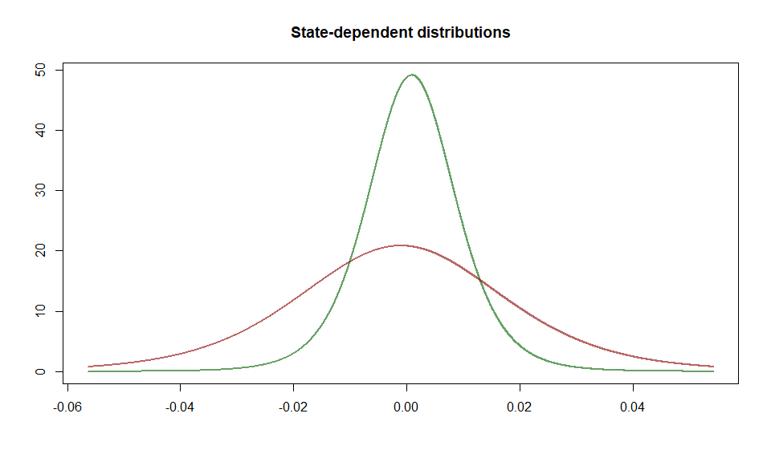

<!-- README.md is generated from README.Rmd. Please edit that file -->

# fHMM 

<!-- badges: start -->

[](https://github.com/loelschlaeger/fHMM/actions)
[](https://www.r-pkg.org/badges/version-last-release/fHMM)
[](https://cranlogs.r-pkg.org/badges/grand-total/fHMM)
[](https://codecov.io/gh/loelschlaeger/fHMM)
<!-- badges: end -->

The goal of fHMM is to detect bearish and bullish markets in financial
time series aplying (hierarchical) hidden Markov models.

## Installation

You can install the released version of fHMM from
[CRAN](https://CRAN.R-project.org) with:

``` r
install.packages("fHMM")
```

And the development version from [GitHub](https://github.com/) with:

``` r
# install.packages("devtools")
devtools::install_github("loelschlaeger/fHMM")
```

## Example: Fitting an HMM to the DAX

``` r
library(fHMM)
#> Thanks for using fHMM version 0.3.0.9000, have fun!
#> See https://loelschlaeger.github.io/fHMM for help.
#> Type 'citation("fHMM")' for citing this R package.
library(magrittr)
```

We fit a 3-state HMM with state-dependent t-distributions to the DAX
log-returns from 2010 to 2020.

The package has a build-in function to download the data from [Yahoo
Finance](https://finance.yahoo.com/):

``` r
download_data(symbol = "^GDAXI", file = "dax.csv", verbose = FALSE)
```

We first need to define the model by setting the `controls`:

``` r
controls = list(
  states = 3,
  sdds   = "t",
  data   = list(file        = "dax.csv",
                date_column = "Date",
                data_column = "Close",
                logreturns  = TRUE,
                from        = "2010-01-01",
                to          = "2020-12-31")
)
(controls %<>% set_controls)
#> fHMM controls:
#> * hierarchy: FALSE 
#> * data type: empirical 
#> * number of states: 3 
#> * sdds: t() 
#> * number of runs: 100
```

The function `prepare_data` prepares the data for estimation:

``` r
data = prepare_data(controls)
summary(data)
#> Summary of fHMM empirical data
#> * number of observations: 2791 
#> * data source: dax.csv 
#> * date column: Date 
#> * log returns: TRUE
```

We now fit the model and subsequentially decode the hidden states:

``` r
model = fit_model(data, ncluster = 7) %>% decode_states 
#> Checking start values
#> Maximizing likelihood
#> Computing Hessian
#> Fitting completed
#> Decoded states
summary(model)
#> Summary of fHMM model
#> 
#>   simulated hierarchy       LL       AIC       BIC
#> 1     FALSE     FALSE 8633.669 -17237.34 -17148.32
#> 
#> State-dependent distributions:
#> t() 
#> 
#> Estimates:
#>                   lb   estimate         ub
#> Gamma_2.1  3.965e-06  3.961e-06  3.957e-06
#> Gamma_3.1  6.191e-03  6.351e-03  6.515e-03
#> Gamma_1.2  1.385e-08  1.384e-08  1.383e-08
#> Gamma_3.2  3.261e-02  3.328e-02  3.397e-02
#> Gamma_1.3  2.715e-02  2.781e-02  2.848e-02
#> Gamma_2.3  4.772e-02  4.874e-02  4.978e-02
#> mu_1      -1.544e-03 -1.459e-03 -1.373e-03
#> mu_2       1.215e-03  1.230e-03  1.244e-03
#> mu_3       1.099e-04  1.330e-04  1.561e-04
#> sigma_1    2.131e-02  2.141e-02  2.151e-02
#> sigma_2    4.994e-03  5.016e-03  5.039e-03
#> sigma_3    1.133e-02  1.137e-02  1.140e-02
#> df_1       7.507e+00  7.679e+00  7.854e+00
#> df_2       4.536e+00  4.592e+00  4.649e+00
#> df_3       1.820e+01  1.890e+01  1.962e+01
#> 
#> States:
#> decoded
#>    1    2    3 
#>  315  943 1533
```

Let’s visualize the estimated state-dependent distributions and the
decoded time series:

``` r
model %>% plot("sdds")
```



``` r
model %>% plot("ts")
```


