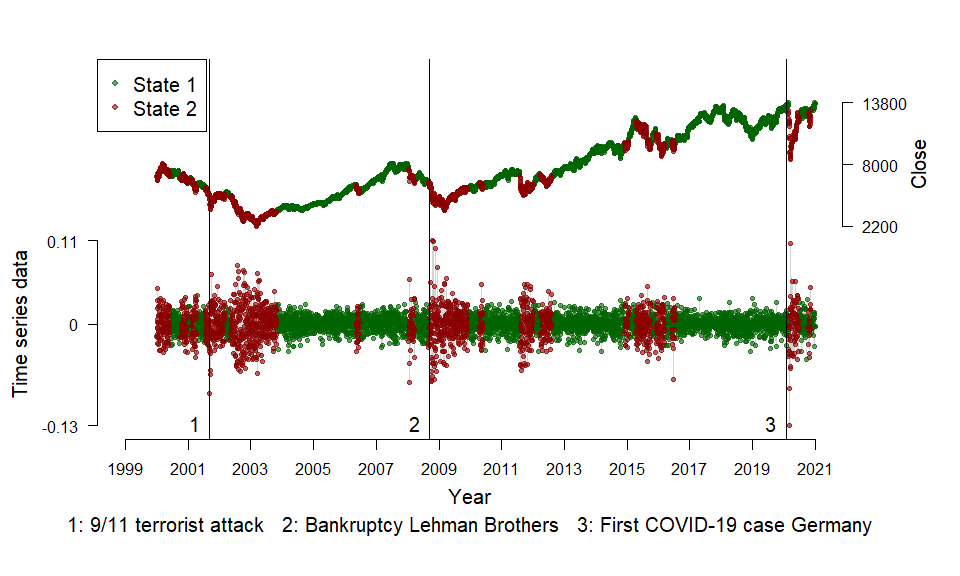

<!-- README.md is generated from README.Rmd. Please edit that file -->

# {fHMM}: Fitting HMMs to financial time series 

<!-- badges: start -->

[](https://github.com/loelschlaeger/fHMM/actions)
[](https://www.r-pkg.org/badges/version-last-release/fHMM)
[](https://cranlogs.r-pkg.org/badges/grand-total/fHMM)
[](https://app.codecov.io/gh/loelschlaeger/fHMM)
<!-- badges: end -->

With {fHMM} you can detect bearish and bullish markets in financial time
series by applying *Hidden Markov Models (HMMs)*. The functionality and
the model [is documented in detail
here](https://loelschlaeger.de/fHMM/articles/). Below, you can find a
first application to the German stock index
[DAX](https://en.wikipedia.org/wiki/DAX).

## Installation

You can install the released version of {fHMM} from
[CRAN](https://CRAN.R-project.org) with:

``` r
install.packages("fHMM")
```

And the development version from [GitHub](https://github.com/) with:

``` r
# install.packages("devtools")
devtools::install_github("loelschlaeger/fHMM")
```

## Contributing

We welcome contributions! Please submit [bug
reports](https://github.com/loelschlaeger/fHMM/issues/new?assignees=&labels=bug&template=bug.md)
and [feature
requests](https://github.com/loelschlaeger/fHMM/issues/new?assignees=&labels=future&template=suggestion.md)
as issues and extensions as pull request from a branch created from
main.

## Example: Fitting an HMM to the DAX

We fit a 2-state HMM with state-dependent t-distributions to the DAX
log-returns from 2000 to 2020. The states can be interpreted as proxies
for bearish and bullish markets.

The package has a build-in function to download the data from [Yahoo
Finance](https://finance.yahoo.com/):

``` r
path <- paste0(tempdir(),"/dax.csv")
download_data(symbol = "^GDAXI", file = path, verbose = FALSE)
```

We first need to define the model by setting some `controls`:

``` r
controls <- list(
  states = 2,
  sdds   = "t",
  data   = list(file        = path,
                date_column = "Date",
                data_column = "Close",
                logreturns  = TRUE,
                from        = "2000-01-01",
                to          = "2020-12-31")
)
controls <- set_controls(controls)
```

The function `prepare_data()` prepares the data for estimation:

``` r
data <- prepare_data(controls)
summary(data)
#> Summary of fHMM empirical data
#> * number of observations: 5371 
#> * data source: dax.csv 
#> * date column: Date 
#> * log returns: TRUE
```

We fit the model and subsequently decode the hidden states:

``` r
model <- fit_model(data, ncluster = 7)
#> Checking start values
#> Maximizing likelihood
#> Computing Hessian
#> Fitting completed
model <- decode_states(model)
#> Decoded states
summary(model)
#> Summary of fHMM model
#> 
#>   simulated hierarchy       LL      AIC       BIC
#> 1     FALSE     FALSE 15920.25 -31824.5 -31771.79
#> 
#> State-dependent distributions:
#> t() 
#> 
#> Estimates:
#>                   lb   estimate         ub
#> Gamma_2.1  0.0113550  0.0179502  2.827e-02
#> Gamma_1.2  0.0056213  0.0089654  1.427e-02
#> mu_1       0.0005939  0.0009008  1.208e-03
#> mu_2      -0.0020763 -0.0010611 -4.585e-05
#> sigma_1    0.0073792  0.0078062  8.258e-03
#> sigma_2    0.0170391  0.0184230  1.992e-02
#> df_1       5.0194906  6.4223618  8.217e+00
#> df_2       4.9532404  6.6609735  8.957e+00
#> 
#> States:
#> decoded
#>    1    2 
#> 3645 1726
```

Having estimated the model, we can visualize the state-dependent
distributions and the decoded time series to interpret bearish and
bullish markets:

``` r
events <- fHMM_events(
  list(dates = c("2001-09-11", "2008-09-15", "2020-01-27"),
       labels = c("9/11 terrorist attack", "Bankruptcy Lehman Brothers", "First COVID-19 case Germany"))
)
plot(model, plot_type = c("sdds","ts"), events = events)
```


