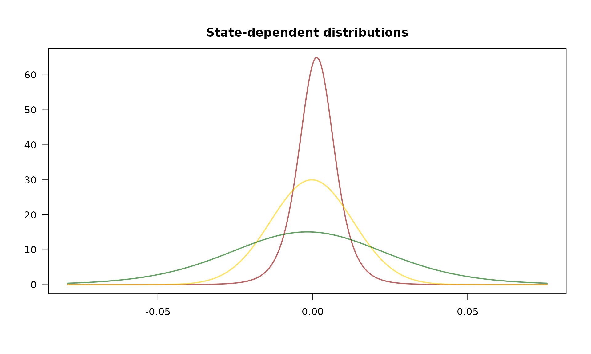
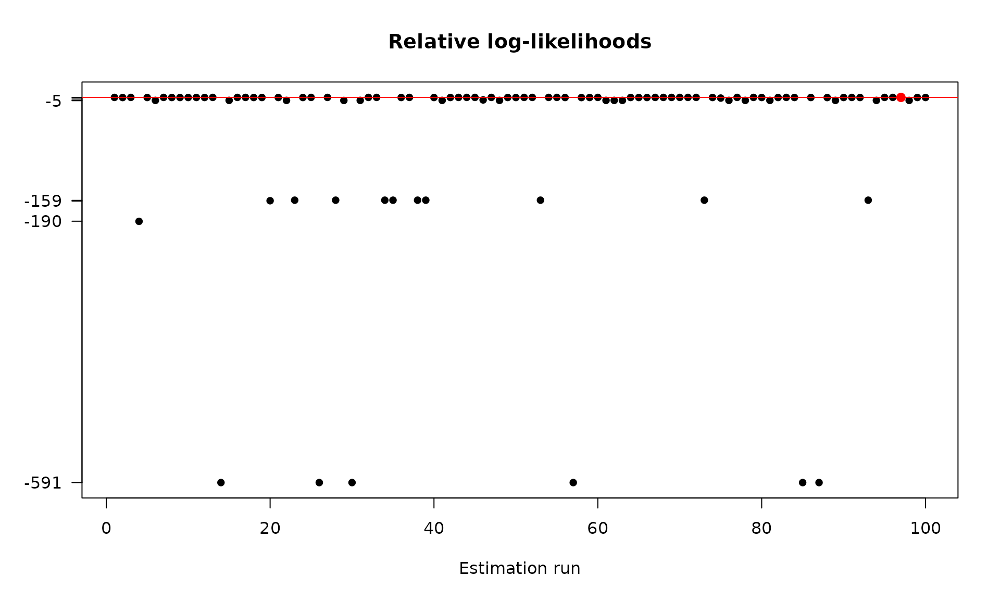

# Model estimation

The [fHMM](https://loelschlaeger.de/fHMM/) package fits a hidden Markov
model via the maximum-likelihood method, i.e. by numerically maximizing
the likelihood function. This vignette[^1] derives the likelihood
formula, discusses challenges associated with the likelihood
maximization and presents the model estimation workflow.

## Likelihood evaluation using the forward algorithm

Deriving the likelihood function of a hidden Markov model is part of the
hierarchical case; hence, the following only discusses the general case.

An HHMM can be treated as an HMM with two conditionally independent data
streams; the coarse-scale observations on the one hand and the
corresponding chunk of fine-scale observations connected to a fine-scale
HMM on the other hand. To derive the likelihood of an HHMM, we start by
computing the likelihood of each chunk of fine-scale observations being
generated by each fine-scale HMM.

To fit the $`i`$-th fine-scale HMM, with model parameters
$`\theta^{*(i)}=(\delta^{*(i)}, \Gamma^{*(i)},(f^{*(i,k)})_k)`$ to the
$`t`$-th chunk of fine-scale observations, which is denoted by
$`(X_{t,t^*})_{t^*}`$, we consider the fine-scale forward probabilities
``` math
\begin{align*}
\alpha^{*(i)}_{k,t^*}=f^{*(i)}(X^*_{t,1},\dots,X^*_{t,t^*}, S^*_{t,t^*}=k),
\end{align*}
```
where $`t^*=1,\dots,T^*`$ and $`k=1,\dots,N^*`$. Using the fine-scale
forward probabilities, the fine-scale likelihoods can be obtained from
the law of total probability as
``` math
\begin{align*}
\mathcal{L}^\text{HMM}(\theta^{*(i)}\mid (X^*_{t,t^*})_{t^*})=\sum_{k=1}^{N^*}\alpha^{*(i)}_{k,T^*}.
\end{align*}
```
The forward probabilities can be calculated in a recursively as
``` math
\begin{align*}
\alpha^{*(i)}_{k,1} &= \delta^{*(i)}_k f^{*(i,k)}(X^*_{t,1}), \\
\alpha^{*(i)}_{k,t^*} &= f^{*(i,k)}(X^*_{t,t^*})\sum_{j=1}^{N^*}\gamma^{*(i)}_{jk}\alpha^{*(i)}_{j,t^*-1}, \quad t^*=2,\dots,T^*.
\end{align*}
```

The transition from the likelihood function of an HMM to the likelihood
function of an HHMM is straightforward: Consider the coarse-scale
forward probabilities
``` math
\begin{align*}
\alpha_{i,t}=f(X_1,\dots,X_t,(X^*_{1,t^*})_{t^*},\dots,(X^*_{t,t^*})_{t^*}, S_t=i),
\end{align*}
```
where $`t=1,\dots,T`$ and $`i=1,\dots,N`$. The likelihood function of
the HHMM results as
``` math
\begin{align*}
\mathcal{L}^\text{HHMM}(\theta,(\theta^{*(i)})_i\mid (X_t)_t,((X^*_{t,t^*})_{t^*})_t)=\sum_{i=1}^{N}\alpha_{i,T}.
\end{align*}
```
The coarse-scale forward probabilities can be calculated similarly by
applying the recursive scheme
``` math
\begin{align*}
\alpha_{i,1} &= \delta_i \mathcal{L}^\text{HMM}(\theta^{*(i)}\mid (X^*_{1,t^*})_{t^*})f^{(i)}(X_1), \\
\alpha_{i,t} &= \mathcal{L}^\text{HMM}(\theta^{*(i)}\mid (X^*_{t,t^*})_{t^*}) f^{(i)}(X_t)\sum_{j=1}^{N}\gamma_{ji}\alpha_{j,t-1}, \quad t=2,\dots,T.
\end{align*}
```

## Challenges associated with the likelihood maximization

To account for parameter constraints associated with the transition
probabilities (and potentially the parameters of the state-dependent
distributions), we use parameter transformations. To ensure that the
entries of the t.p.m.s fulfill non-negativity and the unity condition,
we estimate unconstrained values $`(\eta_{ij})_{i\neq j}`$ for the
non-diagonal entries of $`\Gamma`$ and derive the probabilities using
the multinomial logit link
``` math
\begin{align*}
\gamma_{ij}=\frac{\exp[\eta_{ij}]}{1+\sum_{k\neq i}\exp[\eta_{ik}]},~i\neq j
\end{align*}
```
rather than estimating the probabilities $`(\gamma_{ij})_{i,j}`$
directly. The diagonal entries result from the unity condition as
``` math
\begin{align*}
\gamma_{ii}=1-\sum_{j\neq i}\gamma_{ij}.
\end{align*}
```
Furthermore, variances are strictly positive, which can be achieved by
applying an exponential transformation to the unconstrained estimator.

When numerically maximizing the likelihood using some
Newton-Raphson-type method, we often face numerical under- or overflow,
which can be addressed by maximizing the logarithm of the likelihood and
incorporating constants in a conducive way, see Zucchini et al.
([2016](#ref-zuc16)) and Oelschläger and Adam ([2021](#ref-oel21)) for
details.

As the likelihood is maximized with respect to a relatively large number
of parameters, the obtained maximum can be a local rather than the
global one. To avoid this problem, it is recommended to run the
maximization multiple times from different, possibly randomly selected
starting points, and to choose the model that corresponds to the highest
likelihood, again see Zucchini et al. ([2016](#ref-zuc16)) and
Oelschläger and Adam ([2021](#ref-oel21)) for details.

## Application

For illustration, we fit a 3-state HMM with state-dependent
t-distributions to the DAX data that we prepared in the previous
vignette on data management:

``` r

controls <- list(
  states = 3,
  sdds   = "t",
  data   = list(
    file        = system.file("extdata", "dax.csv", package = "fHMM"),
    date_column = "Date",
    data_column = "Close",
    from        = "2000-01-01",
    to          = "2021-12-31",
    logreturns  = TRUE
  ),
  fit    = list("runs" = 100)
)
controls <- set_controls(controls)
data <- prepare_data(controls)
```

The `data` object can be directly passed to the
[`fit_model()`](https://loelschlaeger.de/fHMM/reference/fit_model.md)
function that numerically maximizes the model’s (log-) likelihood
function `runs = 100` times.[^2] This task can be parallelized by
setting the `ncluster` argument.[^3]

``` r

dax_model_3t <- fit_model(data, seed = 1, verbose = FALSE)
```

The estimated model is saved in the
[fHMM](https://loelschlaeger.de/fHMM/) package and can be accessed as
follows:

``` r

data(dax_model_3t)
```

Calling the [`summary()`](https://rdrr.io/r/base/summary.html) method
provides an overview of the model fit:[^4]

``` r

summary(dax_model_3t)
#> Summary of fHMM model
#> 
#>   simulated hierarchy       LL       AIC       BIC
#> 1     FALSE     FALSE 17650.02 -35270.05 -35169.85
#> 
#> State-dependent distributions:
#> t() 
#> 
#> Estimates:
#>                   lb   estimate        ub
#> Gamma_2.1  2.754e-03  5.024e-03 9.110e-03
#> Gamma_3.1  2.808e-16  2.781e-16 2.739e-16
#> Gamma_1.2  1.006e-02  1.839e-02 3.338e-02
#> Gamma_3.2  1.514e-02  2.446e-02 3.927e-02
#> Gamma_1.3  5.596e-17  5.549e-17 5.464e-17
#> Gamma_2.3  1.196e-02  1.898e-02 2.993e-02
#> mu_1      -3.862e-03 -1.793e-03 2.754e-04
#> mu_2      -7.994e-04 -2.649e-04 2.696e-04
#> mu_3       9.642e-04  1.272e-03 1.579e-03
#> sigma_1    2.354e-02  2.586e-02 2.840e-02
#> sigma_2    1.225e-02  1.300e-02 1.380e-02
#> sigma_3    5.390e-03  5.833e-03 6.312e-03
#> df_1       5.550e+00  1.084e+01 2.116e+01
#> df_2       6.785e+00  4.866e+01 3.489e+02
#> df_3       3.973e+00  5.248e+00 6.934e+00
#> 
#> States:
#> decoded
#>    1    2    3 
#>  704 2926 2252 
#> 
#> Residuals:
#>      Min.   1st Qu.    Median      Mean   3rd Qu.      Max. 
#> -3.517900 -0.664018  0.012170 -0.003262  0.673180  3.693568
```

The estimated state-dependent distributions can be plotted as follows:

``` r

plot(dax_model_3t, plot_type = "sdds")
```



As mentioned above, the HMM likelihood function is prone to local
optima. This effect can be visualized by plotting the log-likelihood
value in the different optimization runs, where the best run is marked
in red:

``` r

plot(dax_model_3t, plot_type = "ll")
```



## References

Oelschläger, L., and T. Adam. 2021. “Detecting Bearish and Bullish
Markets in Financial Time Series Using Hierarchical Hidden Markov
Models.” *Statistical Modelling*, ahead of print.
<https://doi.org/10.1177/1471082X211034048>.

Zucchini, W., I. L. MacDonald, and R. Langrock. 2016. “Hidden Markov
Models for Time Series: An Introduction Using R, 2nd Edition.” *Chapman
and Hall/CRC*.

[^1]: This vignette was built using R 4.6.0 with the
    [fHMM](https://loelschlaeger.de/fHMM/) 1.4.3 package.

[^2]: For convenience, the `controls` object is saved in `data`.

[^3]: If you avoid any problems with clustering on your OS, use
    `ncluster = 1` which avoids any dependency on packages that provide
    clustering.

[^4]: Alternatively, [`coef()`](https://rdrr.io/r/stats/coef.html) only
    returns the estimated model coefficients
