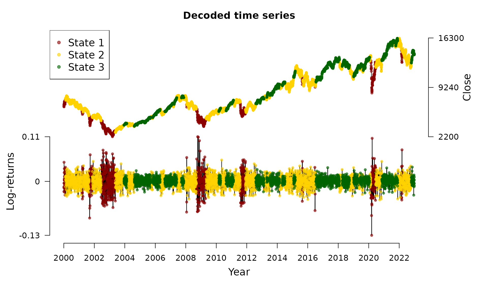

# State decoding and prediction

This vignette[^1] introduces the Viterbi algorithm for state decoding.
The decoded state sequence in combination with the estimated model
parameters can be used for forecasting.

## State decoding using the Viterbi algorithm

For financial markets, it is of special interest to infer the underlying
(hidden) states in order to gain insight about the actual market
situation. Decoding a full time series $`S_1, \ldots, S_T`$ is called
*global decoding*. Here, we aim to find the most likely trajectory of
hidden states under the estimated model. Global decoding can be
accomplished by using the so-called Viterbi algorithm which is a
recursive scheme enabling to find the global maximum without being
confronted with huge computational costs. To this end, we follow
Zucchini et al. ([2016](#ref-zuc16)) and define
``` math
\zeta_{1i} = Pr(S_1 = i, X_1 = x_1) = \delta_i p_i(x_1)
```
for $`i = 1, \ldots, N`$ and for the following $`t = 2, \ldots, T`$
``` math
\zeta_{ti} = \operatorname*{max}_{s_1, \ldots, s_{t-1}} Pr(S_{t-1} = s_{t-1}, S_t = i, X_t = x_t).
```
Then, the trajectory of most likely states $`i_1, \ldots, i_T`$ can be
calculated recursively from
``` math
i_T = \operatorname*{argmax}_{i = 1, \ldots, N} \zeta_{Ti}
```
and for the following $`t = T-1, \ldots, 1`$ from
``` math
i_t = \operatorname*{argmax}_{i = 1, \ldots, N} (\zeta_{ti} \gamma_{i, i_{t+1}}).
```
Transferring the state decoding to HHMMs is straightforward: first, the
coarse-scale state process must be decoded. Afterwards, this information
can be used to decode the fine-scale state process, see Adam et al.
([2019](#ref-ada19)).

## The `decode_states()` function

We revisit the DAX model of the vignette on model estimation:

``` r

data(dax_model_3t)
```

The underlying states can be decoded via the
[`decode_states()`](https://loelschlaeger.de/fHMM/reference/decode_states.md)
function:

``` r

dax_model_3t <- decode_states(dax_model_3t)
#> Decoded states
```

We now can visualize the decoded time series:

``` r

plot(dax_model_3t)
```



## Invariance Toward State Labeling

Mind that the model is invariant to permutations of the state labels.
Therefore, [fHMM](https://loelschlaeger.de/fHMM/) provides the option to
switch labels after decoding via the
[`reorder_states()`](https://loelschlaeger.de/fHMM/reference/reorder_states.md)
function, for example:

``` r

dax_model_3t <- reorder_states(dax_model_3t, 3:1)
```

## Prediction

Having decoded the underlying states, it is possible to compute the
state probabilities of next observations. Based on these probabilities
and in combination with the estimated state-dependent distributions,
next observations can be predicted, compare Zucchini et al.
([2016](#ref-zuc16)):

``` r

predict(dax_model_3t, ahead = 10)
#>    state_1 state_2 state_3       lb estimate      ub
#> 1  0.00000 0.02446 0.97554 -0.01065  0.00123 0.01311
#> 2  0.00012 0.04773 0.95215 -0.01092  0.00120 0.01332
#> 3  0.00036 0.06988 0.92976 -0.01119  0.00116 0.01352
#> 4  0.00070 0.09095 0.90835 -0.01145  0.00113 0.01371
#> 5  0.00115 0.11099 0.88786 -0.01170  0.00110 0.01390
#> 6  0.00169 0.13006 0.86825 -0.01195  0.00107 0.01408
#> 7  0.00231 0.14821 0.84948 -0.01218  0.00104 0.01426
#> 8  0.00301 0.16547 0.83152 -0.01241  0.00101 0.01443
#> 9  0.00379 0.18189 0.81432 -0.01263  0.00098 0.01459
#> 10 0.00463 0.19751 0.79786 -0.01285  0.00095 0.01476
```

## References

Adam, T., C. A. Griffiths, V. Leos-Barajas, et al. 2019. “Joint
Modelling of Multi-Scale Animal Movement Data Using Hierarchical Hidden
Markov Models.” *Methods in Ecology and Evolution* 10 (9): 1536–50.

Zucchini, W., I. L. MacDonald, and R. Langrock. 2016. “Hidden Markov
Models for Time Series: An Introduction Using R, 2nd Edition.” *Chapman
and Hall/CRC*.

[^1]: This vignette was built using R 4.6.0 with the
    [fHMM](https://loelschlaeger.de/fHMM/) 1.4.3 package.
