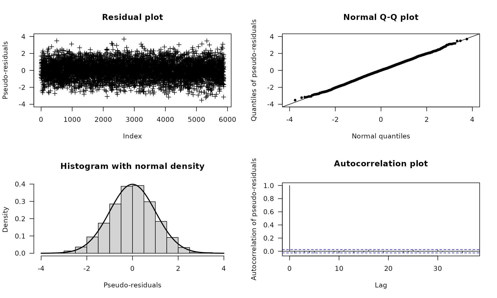

# Model checking

This vignette[^1] discusses model checking in
[fHMM](https://loelschlaeger.de/fHMM/), that means the task of verifying
whether the fitted model describes the data well.

## Model checking using pseudo-residuals

Since the observations are explained by different distributions
(depending on the active state), model checking cannot be done by
analyzing standard residuals. Instead, we consider “pseudo-residuals”.
To transform all observations on a common scale, we proceed as follows:
If $`X_t`$ has the invertible distribution function $`F_{X_t}`$, then

``` math
\begin{align*}
Z_t=\Phi^{-1}(F_{X_t} (X_t))
\end{align*}
```

is standard normally distributed, where $`\Phi`$ denotes the cumulative
distribution function of the standard normal distribution. The
observations, $`(X_t)_t`$, are modeled well if the so-called
pseudo-residuals, $`(Z_t)_t`$, are approximately standard normally
distributed, which can be visually assessed using quantile-quantile
plots or further investigated using statistical tests such as the
Jarque-Bera test ([Zucchini et al. 2016](#ref-zuc16)).

For HHMMs, we first decode the coarse-scale state process using the
Viterbi algorithm. Subsequently, we assign each coarse-scale observation
its distribution function under the fitted model and perform the
transformation described above. Using the Viterbi-decoded coarse-scale
states, we then treat the fine-scale observations analogously.

## Implementation

In [fHMM](https://loelschlaeger.de/fHMM/), pseudo-residuals can be
computed via the
[`compute_residuals()`](https://loelschlaeger.de/fHMM/reference/compute_residuals.md)
function, provided that the states have been decoded beforehand.

We revisit the DAX example:

``` r

data(dax_model_3t)
```

The following line computes the residuals and saves them into the
`model` object:

``` r

dax_model_3t <- compute_residuals(dax_model_3t)
#> Computed residuals
```

The residuals can be visualized as follows:

``` r

plot(dax_model_3t, plot_type = "pr")
```



For additional normality tests, the residuals can be extracted from the
`model` object via the
[`residuals()`](https://rdrr.io/r/stats/residuals.html) method. The
following lines perform a [Jarque–Bera
test](https://en.wikipedia.org/wiki/Jarque%E2%80%93Bera_test) as an
example ([Jarque and Bera 1987](#ref-jar87)):

``` r

tseries::jarque.bera.test(residuals(dax_model_3t))
#> 
#>  Jarque Bera Test
#> 
#> data:  residuals(dax_model_3t)
#> X-squared = 2.2403, df = 2, p-value = 0.3262
```

## References

Jarque, C. M., and A. K. Bera. 1987. “A Test for Normality of
Observations and Regression Residuals.” *International Statistical
Review / Revue Internationale de Statistique* 55: 163–72.

Zucchini, W., I. L. MacDonald, and R. Langrock. 2016. “Hidden Markov
Models for Time Series: An Introduction Using R, 2nd Edition.” *Chapman
and Hall/CRC*.

[^1]: This vignette was built using R 4.6.0 with the
    [fHMM](https://loelschlaeger.de/fHMM/) 1.4.3 package.
