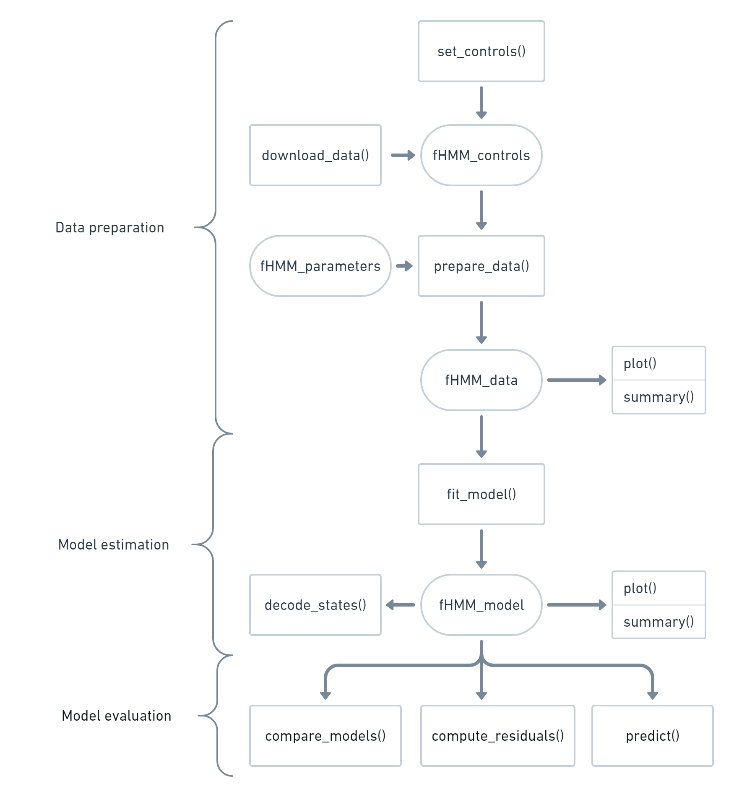

```{r, include = FALSE}
knitr::opts_chunk$set(
  collapse = TRUE,
  comment = "#>",
  fig.path = "fHMM-"
)
```

Welcome to `{fHMM}`, an R package for modeling financial time series data with hidden Markov models (HMMs). This introduction [motivates the approach](#motivation), gives an [overview](#package-and-vignettes-overview) of the package functionality and the included vignettes, and [places the approach in the existing literature](#placement-in-the-literature).

## Motivation

Earning money with stock trading is simple: one "only" needs to buy and sell stocks at the right moment. In general, stock traders seek to invest at the beginning of upward trends (hereon termed as bullish markets) and repel their stocks just in time before the prices fall again (hereon termed as bearish markets). As stock prices depend on a variety of environmental factors [@hum09; @coh13], chance certainly plays a fundamental role in hitting those exact moments. However, investigating market behavior can lead to a better understanding of how trends alternate and thereby increases the chance of making profitable investment decisions. 

The `{fHMM}` package aims at contributing to those investigations by applying HMMs to detect bearish and bullish markets in financial time series. It also implements the hierarchical model extension presented in @oel21, which improves the model's capability for distinguishing between short- and long-term trends and allows to interpret market dynamics at multiple time scales.

## Package and vignettes overview

The functionality of the `{fHMM}` package can be classified into functions for data preparation, model estimation, and model evaluation. The following flowchart visualizes their dependencies:

{width=80%}

The tasks *data preparation*, *model estimation*, and *model evaluation* as well as their corresponding functions and classes are explained in detail in separate vignettes:

- The vignette [*Model definition*](https://loelschlaeger.de/fHMM/articles/v01_model_definition.html) defines the HMM and its hierarchical extension.

- The vignette [*Controls*](https://loelschlaeger.de/fHMM/articles/v02_controls.html) introduces the `set_controls()` function which is used for model specifications.

- The vignette [*Data management*](https://loelschlaeger.de/fHMM/articles/v03_data_management.html) explains how to prepare or simulate data and introduces the `download_data()` function that can download financial data directly from <https://finance.yahoo.com/>.

- The vignette [*Model estimation*](https://loelschlaeger.de/fHMM/articles/v04_model_estimation.html) defines the likelihood function and explains the task of its numerical maximization via the `fit_model()` function.

- The vignette [*State decoding and prediction*](https://loelschlaeger.de/fHMM/articles/v05_state_decoding_and_prediction.html) introduces the Viterbi algorithm that is used for decoding the most likely underlying state sequence and subsequently for forecasting. 

- The vignette [*Model checking*](https://loelschlaeger.de/fHMM/articles/v06_model_checking.html) explains the task of checking a fitted model via computing (pseudo-) residuals, which is implemented in the `compute_residuals()` function.

- The vignette [*Model selection*](https://loelschlaeger.de/fHMM/articles/v07_model_selection.html) discusses the task of selecting the (in some sense) best model among a set of competing models via the `compare_models()` function. 

## Placement in the literature

Over the last decades, various HMM-type models have emerged as popular tools for modeling financial time series that are subject to state-switching over time [@sch97; @dia09; @ang12; @dea17]. @ryd98, @bul06, and @nys15a, e.g., used HMMs to derive stylized facts of stock returns, while @has05 and @nys17 demonstrated that HMMs can prove useful for economic forecasting. More recently, @lih17 applied HMMs to the Standard and Poor's 500, where HMMs were used to identify different levels of market volatility, aiming at providing evidence for the conjecture that returns exhibit negative correlation with volatility. Another application to the S\&P 500 can be found in @ngu18, where HMMs were used to predict monthly closing prices to derive an optimal trading strategy, which was shown to outperform the conventional buy-and-hold strategy. Further applications, which involve HMM-type models for asset allocation and portfolio optimization, can be found in @ang02, @bul11, @nys15a and @nys18, to name but a few examples. All these applications demonstrate that HMMs constitute a versatile class of time series models that naturally accounts for the dynamics typically exhibited by financial time series.

## References
