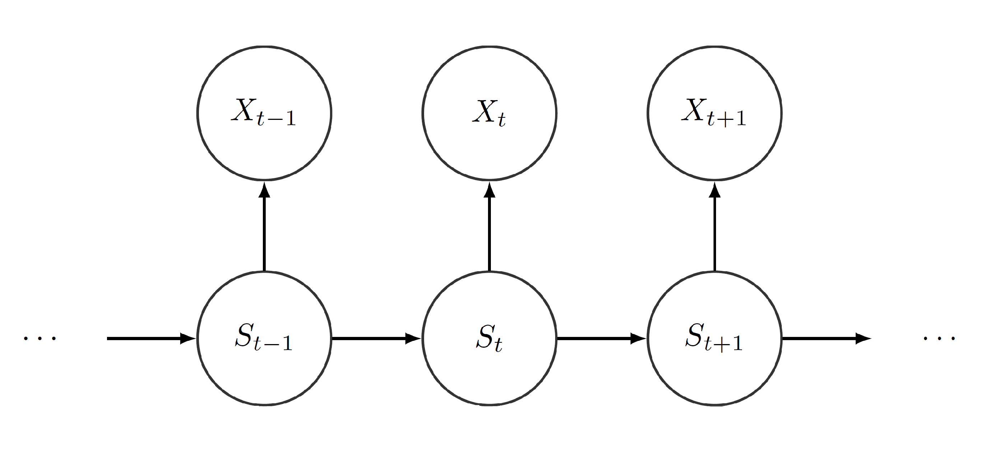
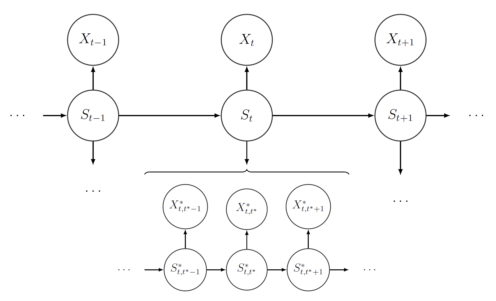

  
```{r, include = FALSE}
knitr::opts_chunk$set(
  collapse = TRUE,
  comment = "#>",
  fig.path = "fHMM-"
)
```

The `{fHMM}` package is an implementation of the hidden Markov model with a focus on applications to financial time series data. This vignette^[This vignette was build using R `r paste(R.Version()[c("major", "minor")], collapse = ".")` with the `{fHMM}` `r utils::packageVersion("fHMM")` package.] introduces the model and its hierarchical extension. It closely follows @oel21.

## The Hidden Markov Model

Hidden Markov models (HMMs) are a modeling framework for time series data where a sequence of observation is assumed to depend on a latent state process. The peculiarity is that, instead of the observation process, the state process cannot be directly observed. However, the latent states comprise information about the environment the model is applied on. 

The connection between hidden state process and observed state-dependent process arises by the following: Let $N$ be the number of possible states. We assume that for each point in time $t = 1, \ldots, T$, an underlying process $(S_t)_{t = 1, \ldots, T}$ selects one of those $N$ states. Then, depending on the active state $S_t \in \{ 1, \ldots, N \}$, the observation $X_t$ from the state-dependent process $(X_t)_{t = 1, \ldots, T}$ is generated by one of $N$ distributions $f^{(1)},\dots,f^{(N)}.$^[The package includes the normal- and t-distribution for modeling log-returns and the gamma distribution for modeling absolute quantities like trading volume. Additionally, log-normal distributions can be specified.]

Furthermore, we assume $(S_t)_t$ to be Markovian, i.e. we assume that the actual state only depends on the previous state. Henceforth, we can identify the process by its initial distribution $\delta$ and its transition probability matrix (t.p.m.) $\Gamma$. Moreover, by construction, we force the process $(X_t)_{t = 1, \ldots, T}$ to satisfy the conditional independence assumption, i.e. the actual observation $X_t$ depends on the current state $S_t$, but does not depend on previous observations or states at all. The following graphic visualizes the dependence structure:

{width=80%}

Referring to financial data, the different states can serve as proxies for the actual market situation, e.g. calm or nervous. Even though these moods cannot be observed directly, price changes or trading volumes, which clearly depend on the current mood of the market, can be observed. Thereby, using an underlying Markov process, we can detect which mood is active at any point in time and how the different moods alternate. Depending on the current mood, a price change is generated by a different distribution. These distributions characterize the moods in terms of expected return and volatility.^[For example, we can model price changes at time point $t$ to be generated by different normal distributions whose mean and volatility depend on $S_t$.]

Following @zuc16, we assume that the initial distribution $\delta$ equals the stationary distribution $\pi$, where $\pi = \pi \Gamma$, i.e. the stationary and henceforth the initial distribution is determined by $\Gamma$.^[If the Markov process is irreducible, it has a unique distribution, which solves $\pi = \pi \Gamma$. If
additionally the Markov process is aperiodic, its state distribution converges to the stationary distribution, see @nor97. Irreducibility and aperiodicity are usually satisfied assumptions in reality.] This is reasonable from a practical point of view: On the one hand, the hidden state process has been evolving for some time before we start to observe it and hence can be assumed to be stationary. On the other hand, setting $\delta=\pi$ reduces the number of parameters that need to be estimated, which is convenient from a computational perspective.

## Adding a Hierarchical Structure

The hierarchical hidden Markov model (HMMM) is a flexible extension of the HMM  that can jointly model data observed on two different time scales. The two time series, one on a coarser and one on a finer scale, differ in the number of observations, e.g. monthly observations on the coarser scale and daily or weekly observations on the finer scale. 

Following the concept of HMMs, we can model both state-dependent time series jointly. First, we treat the time series on the coarser scale as stemming from an ordinary HMM, which we refer to as the coarse-scale HMM: At each time point $t$ of the coarse-scale time space $\{1,\dots,T\}$, an underlying process $(S_t)_t$ selects one state from the coarse-scale state space $\{1,\dots,N\}$. We call $(S_t)_t$ the hidden coarse-scale state process. Depending on which state is active at $t$, one of $N$ distributions $f^{(1)},\dots,f^{(N)}$ realizes the observation $X_t$. The process $(X_t)_t$ is called the observed coarse-scale state-dependent process. The processes $(S_t)_t$ and $(X_t)_t$ have the same properties as before, namely $(S_t)_t$ is a first-order Markov process and $(X_t)_t$ satisfies the conditional independence assumption. 

Subsequently, we segment the observations of the fine-scale time series into $T$ distinct chunks, each of which contains all data points that correspond to the $t$-th coarse-scale time point. Assuming that we have $T^*$ fine-scale observations on every coarse-scale time point, we face $T$ chunks comprising of $T^*$ fine-scale observations each. 

The hierarchical structure now evinces itself as we model each of the chunks by one of $N$ possible fine-scale HMMs. Each of the fine-scale HMMs has its own t.p.m.\ $\Gamma^{*(i)}$, initial distribution $\delta^{*(i)}$, stationary distribution $\pi^{*(i)}$, and state-dependent distributions $f^{*(i,1)},\dots,f^{*(i,N^*)}$. Which fine-scale HMM is selected to explain the $t$-th chunk of fine-scale observations depends on the hidden coarse-scale state $S_t$. The $i$-th fine-scale HMM explaining the $t$-th chunk of fine-scale observations consists of the following two stochastic processes: At each time point $t^*$ of the fine-scale time space $\{1,\dots,T^*\}$, the process $(S^*_{t,t^*})_{t^*}$ selects one state from the fine-scale state space $\{1,\dots,N^*\}$. We call $(S^*_{t,t^*})_{t^*}$ the hidden fine-scale state process. Depending on which state is active at $t^*$, one of $N^*$ distributions $f^{*(i,1)},\dots,f^{*(i,N^*)}$ realizes the observation $X^*_{t,t^*}$. The process $(X^*_{t,t^*})_{t^*}$ is called the observed fine-scale state-dependent process. 

The fine-scale processes $(S^*_{1,t^*})_{t^*},\dots,(S^*_{T,t^*})_{t^*}$ and $(X^*_{1,t^*})_{t^*},\dots,(X^*_{T,t^*})_{t^*}$ satisfy the Markov property and the conditional independence assumption, respectively, as well. Furthermore, it is assumed that the fine-scale HMM explaining $(X^*_{t,t^*})_{t^*}$ only depends on $S_t$. This hierarchical structure is visualized in the following:

{width=80%}

## References

